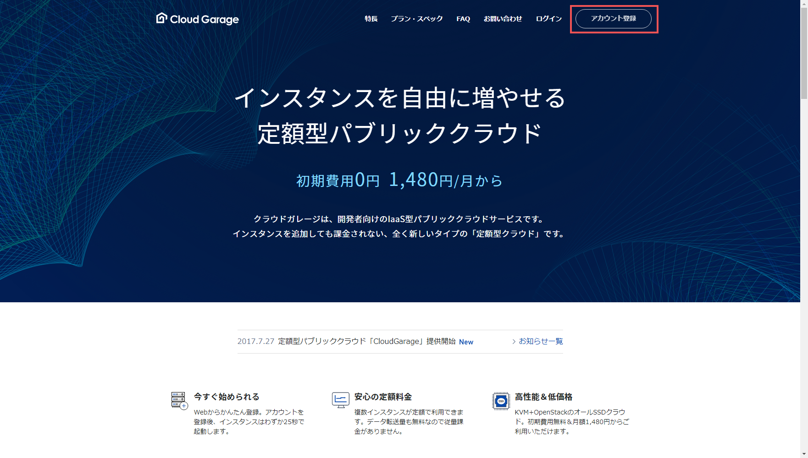
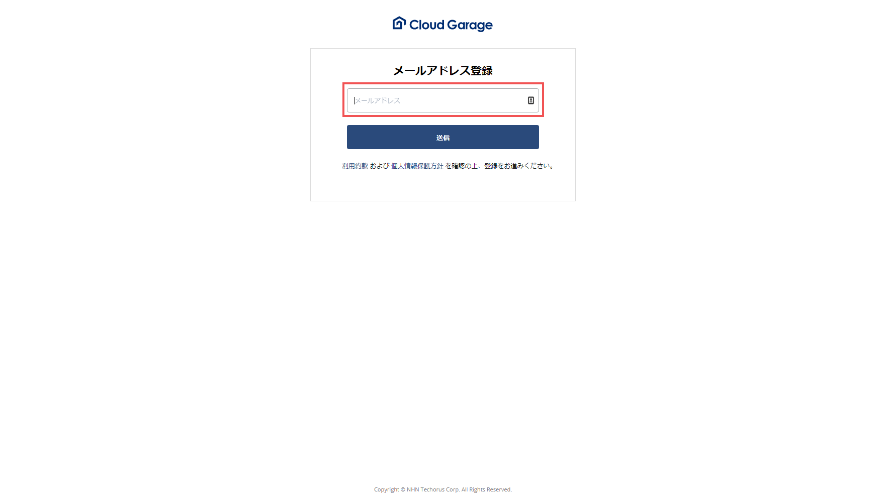
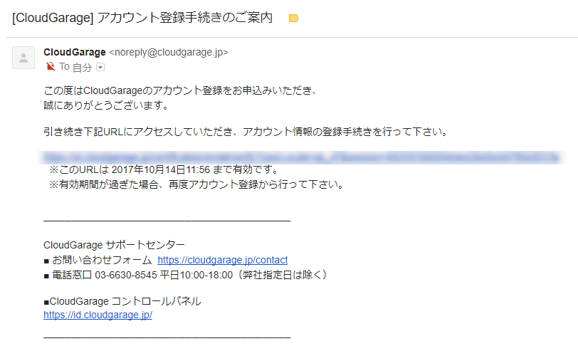
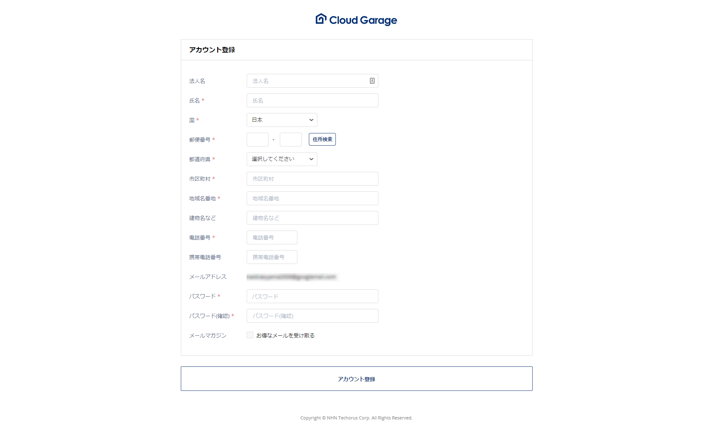
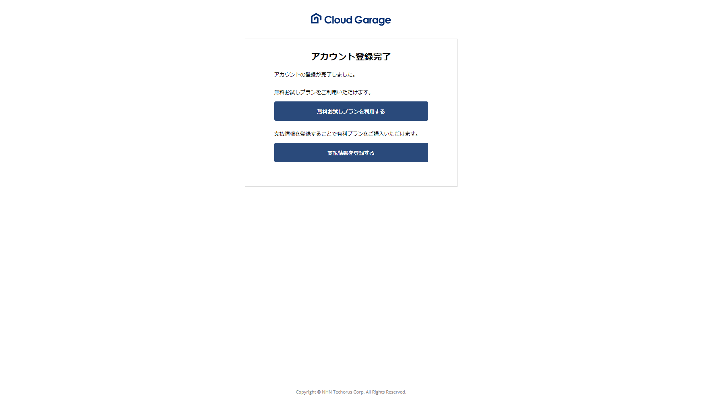
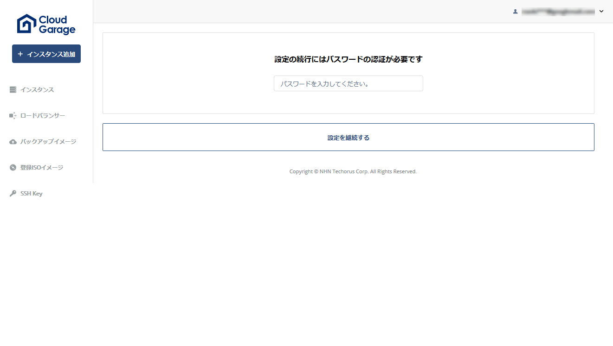
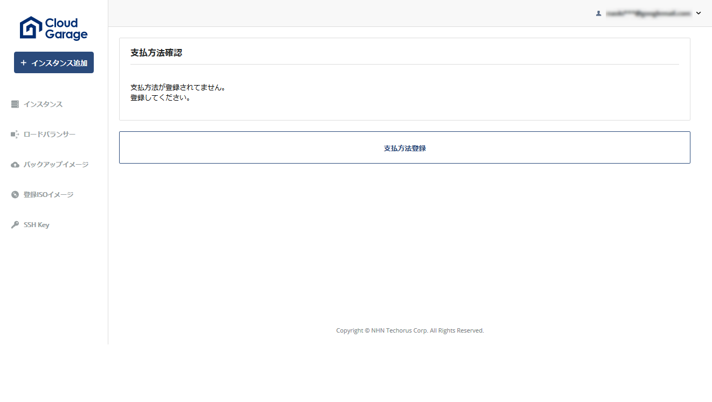
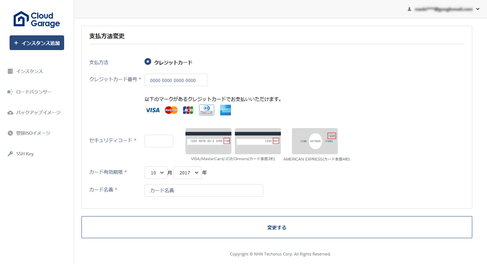
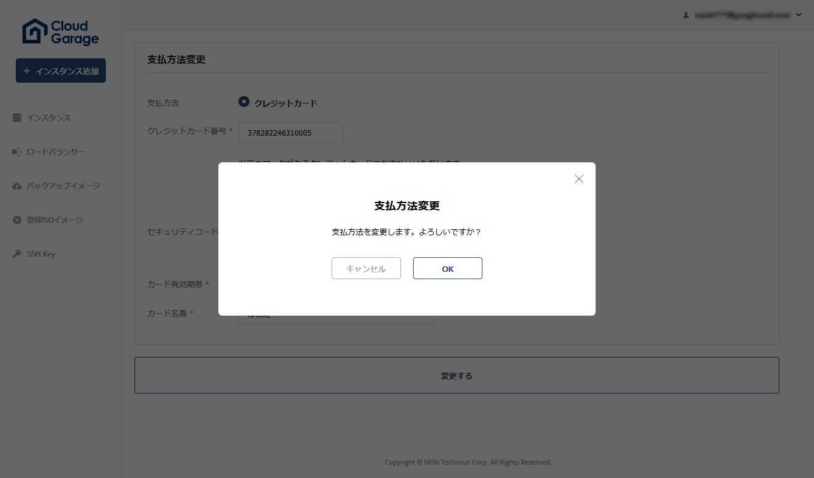
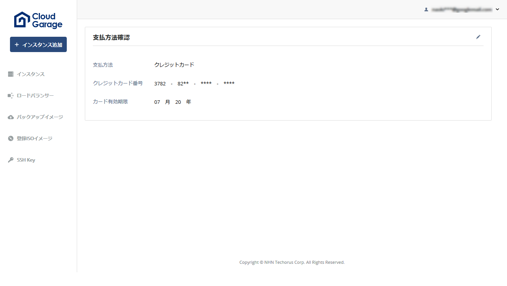

アカウント登録
==============

.. note::
   | この情報は、 **2017/10/14** に実施した時の情報です。
   | 現在の画面とは違うかもしれません。参考までに記載しています。
   | この記事を再編成したものになります。
   | https://qiita.com/FoxBoxsnet/items/346024d0e9dc144f60d1

.. sidebar:: 目次

   .. contents::
      :depth: 3
      :local:

.. _overview:

概要
----

ここでは CloudGarage のアカウント登録までを紹介します。

----

.. _registering-an-account:

``アカウント登録`` をクリック

----

.. _enter-your-email-address:

メールアドレスの入力
~~~~~~~~~~~~~~~~~~~~

----

入力したアドレス宛にメールが来ます。

.. note::
 | サービス公開当初(2017/07/27)はメールアドレスが ``cs@cloudgarage.jp`` でしたが、現在は ``noreply@cloudgarage.jp`` よりメールが来ます。

   .. image:: ../img/tutorial-registering-an-account_004.png

   https://twitter.com/CloudGarage_PR/status/907467497435160577

----

.. _required-information-input:

必要事項を入力
~~~~~~~~~~~~~~

----

.. _complete-the-account-registration:

アカウント登録完了
~~~~~~~~~~~~~~~~~~

.. _after-completing-the-account-registration:

アカウント登録完了後
--------------------

.. _to-use-the-free-trial-plan:

無料お試しプランを利用する
~~~~~~~~~~~~~~~~~~~~~~~~~~

``無料お試しプランを利用する`` ボタンをクリックするとログイン画面に移動しますので、ログインして使用します

参考: :doc:`/tutorial/docs/tutorial-login`

----

.. _to-register-payment-information:

支払情報を登録する
~~~~~~~~~~~~~~~~~~

``支払情報を登録する`` ボタンをクリックするとパスワードを求められますので入力して次にすすみます。

----

``支払方法登録`` をクリックします。

----

各種必要事項を入力し ``変更する`` をクリック

----

``OK`` をクリック

----

``支払方法確認`` 画面に推移します。ので確認します。

